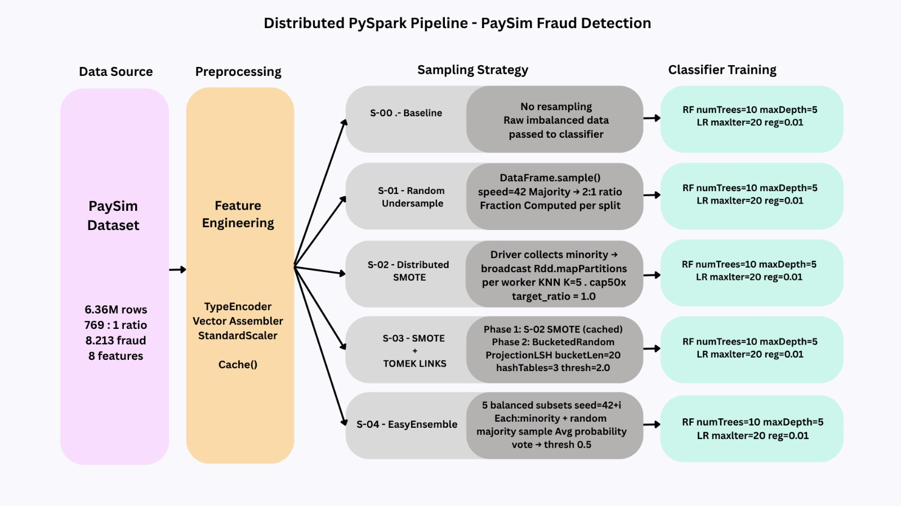

# Distributed Fraud Detection using PySpark

<p align="center">
  
</p>

<p align="center">
  <b>Distributed Machine Learning Pipeline for Financial Fraud Detection on the PaySim Dataset</b>
</p>

<p align="center">
  PySpark • Random Forest • Logistic Regression • Distributed SMOTE • Tomek Links • EasyEnsemble
</p>

---

# Overview

This project presents a **distributed fraud detection system** developed using **PySpark** for large-scale financial transaction analysis on the **PaySim dataset**.

The study investigates how different **sampling strategies** handle severe class imbalance in fraud detection tasks using distributed machine learning techniques.

The pipeline evaluates:

- Baseline learning
- Random Undersampling
- Distributed SMOTE
- SMOTE + Tomek Links
- EasyEnsemble

using:

- Random Forest (RF)
- Logistic Regression (LR)

on a dataset containing over **6.36 million transactions**.

---

# Key Features

- Distributed PySpark pipeline
- Large-scale fraud detection
- Distributed SMOTE implementation
- Tomek Links boundary cleaning
- EasyEnsemble implementation
- Random Forest & Logistic Regression classifiers
- Spark MLlib integration
- Evaluation using:
  - Precision
  - Recall
  - F1 Score
  - AUC-ROC
- Scalable distributed processing

---

# Dataset Information

| Metric | Value |
|---|---|
| Dataset | PaySim |
| Total Transactions | 6.36 Million |
| Fraud Cases | 8,213 |
| Fraud Rate | 0.13% |
| Class Imbalance | 769:1 |

---

# Project Structure

```bash
distributed-fraud-detection-pyspark/
│
├── README.md
├── requirements.txt
├── paysim.ipynb
├── Presentation.pdf
├── Pipeline.jpeg
│
└── images/
```

---

# Technologies Used

| Technology | Purpose |
|---|---|
| Python | Core Programming |
| PySpark | Distributed Processing |
| Spark MLlib | Machine Learning |
| NumPy | Numerical Computation |
| Pandas | Data Processing |
| Jupyter Notebook | Experimentation |
| Matplotlib | Visualization |

---

# Distributed Pipeline Architecture

The fraud detection workflow follows a distributed PySpark architecture:

1. Data Loading
2. Feature Engineering
3. Data Scaling
4. Sampling Strategy Application
5. Model Training
6. Distributed Evaluation
7. Metrics Comparison

---

# Feature Engineering

Selected Features:

- `step`
- `type`
- `amount`
- `oldbalanceOrg`
- `newbalanceOrig`
- `oldbalanceDest`
- `newbalanceDest`

Removed Features:

- `nameOrig`
- `nameDest`

Reason:
Identifier columns do not provide predictive value and introduce unnecessary noise.

---

# Sampling Strategies

| Strategy | Description |
|---|---|
| S-00 | Baseline (No Resampling) |
| S-01 | Random Undersampling |
| S-02 | Distributed SMOTE |
| S-03 | SMOTE + Tomek Links |
| S-04 | EasyEnsemble |

---

# Distributed SMOTE

This project implements a custom distributed version of SMOTE using PySpark.

## Process

- Minority fraud samples collected from partitions
- Broadcast variables used for worker distribution
- KNN-based interpolation generates synthetic fraud samples
- Fully distributed processing using Spark workers

## Advantages

- Reduces driver bottlenecks
- Scales efficiently on large datasets
- Avoids heavy shuffle operations

---

# Models Used

## Random Forest

Parameters:

```python
numTrees = 10
maxDepth = 5
seed = 42
```

Advantages:
- Handles non-linear decision boundaries
- Robust against noisy synthetic samples
- Best overall performance

---

## Logistic Regression

Parameters:

```python
maxIter = 20
regParam = 0.01
```

Advantages:
- Fast distributed training
- Lightweight baseline classifier

---

# Experimental Results

## Best Performing Strategy

| Model | Strategy | F1 Score | AUC-ROC |
|---|---|---|---|
| Random Forest | Distributed SMOTE | 0.833 | 0.986 |

---

# Full Results (100% Dataset Scale)

## Random Forest

| Strategy | Recall | Precision | F1 Score | AUC | Time (s) |
|---|---|---|---|---|---|
| Baseline | 0.640 | 0.991 | 0.778 | 0.962 | 93 |
| Undersampling | 0.977 | 0.028 | 0.054 | 0.996 | 50 |
| Distributed SMOTE | 0.729 | 0.972 | 0.833 | 0.986 | 413 |
| SMOTE + Tomek | 0.727 | 0.970 | 0.831 | 0.989 | 3338 |
| EasyEnsemble | 0.981 | 0.027 | 0.053 | 0.996 | 411 |

---

# Key Findings

- Distributed SMOTE achieved the best balance between Recall and Precision.
- Random Forest consistently outperformed Logistic Regression.
- SMOTE + Tomek Links improved boundary cleaning but increased runtime significantly.
- EasyEnsemble achieved extremely high Recall but poor Precision.
- F1 Score proved to be the most important evaluation metric for fraud detection.

---

# Scalability

The pipeline was evaluated across:

- 10% dataset scale
- 30% dataset scale
- 100% dataset scale

Results show efficient distributed scaling using Spark with manageable training times.

---

# How to Run

## 1. Clone Repository

```bash
git clone https://github.com/tharungurunathan/distributed-fraud-detection-pyspark.git
```

---

## 2. Install Requirements

```bash
pip install -r requirements.txt
```

---

## 3. Launch Notebook

```bash
jupyter notebook
```

Open:

```bash
paysim.ipynb
```

---

# Requirements

```txt
pyspark
numpy
pandas
scikit-learn
matplotlib
jupyter
```

---

# Future Improvements

- XGBoost / Gradient Boosting
- Spark Structured Streaming
- Real-time fraud scoring
- Hyperparameter tuning
- Graph-based fraud ring detection
- Cost-sensitive learning

---

# Research Contributions

This project demonstrates:

- Distributed handling of imbalanced big data
- Efficient Spark-based oversampling
- Large-scale fraud detection architecture
- Comparative evaluation of sampling strategies

---

# Author

## Tharun Gurunathan

University of Nottingham  
School of Computer Science

GitHub:
https://github.com/tharungurunathan

---

# License

This project is developed for academic and research purposes.
